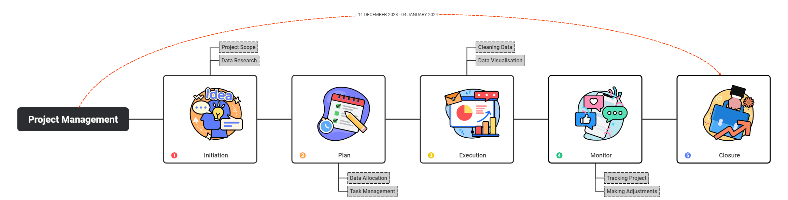

# Project 3 Group 3 Data Visualization

[webpage](https://gadriano11.github.io/project-group3-dataviz-story/)

## Table of Contents

1. [Introduction](#Introduction)
2. [Project Brief](#ProjectBrief)
3. [Languages and Tools](#PLanguage&Tools)
4. [Project Flow](#ProjectFlow)
5. [Data Insight](#DataInsights)
6. [Collaborators](#Collaborators)
7. [Data Sources](#Sources)

## Introduction:

Global poverty is one of the most pressing challenges we face today. The poorest individuals around the world lack access to basic necessities such as food, clean water, and education. Understanding poverty trends and patterns is crucial for addressing this issue effectively.

This repository contains researced data, visualizations, and other documentations related to poverty. A breakdown of the project includes project structure, workflow and resources to provide insights on collaboration. The goal is to provide useful data to manage projects for future users and how data can be used to provide solutions for tackling poverty issue.   

## 🖥 Project Brief

Our project aims to conduct a comparative data analysis of global poverty focusing on the intricate relationship between poverty, education and corruption factors. The primary objective is to unravel the complex interplay of these elements through data visualisation to inform targeted interventions and policies aimed at poverty alleviation. 

## 🧰 Languages and Tools

In this project we outline the tools, language and libraries required to complete the project brief.
 

  

  
  

### HighChart JS Library

The official npm package contains Highcharts, including the Stock, Maps and Gantt packages, plus all modules. Start by installing Highcharts as a node module and save it as a dependency in your package.json:

    npm install highcharts --save
 
Include the JavaScript files in the head section of the webpage as shown below:

    

## 💡  Project Flow

## 💡  Data Insights

Key Insights: 

Measuring Poverty: Different countries use varying poverty lines to define who is considered poor. For instance, while the United States sets a poverty line at roughly $24.55 per day, Ethiopia’s poverty line is set at just $2.04 per day. To measure global poverty consistently, we use the International Poverty Line of $2.15 per day,
established by the World Bank and the UN.

Decline in Extreme Poverty:

Over the last generation, global extreme poverty has significantly decreased. However, millions still live in extreme poverty, especially in low-income countries.

Challenges Ahead: 

Despite progress, hundreds of millions remain in extreme poverty. Addressing this requires continued efforts and innovative solutions.

  
## 👨‍💼💻👩‍💼 Collaborators

| 
Contributors
    | 
Github Profile
    |
| ----------------| -------------------------------------- |
| 
Gabriel 
      | https://github.com/gadriano11       |    
| 
Oormi
 |   https://github.com/OormiC             |
| 
Rajendrar
| https://github.com/rajbondili           |
| 
Choon Sien
| https://github.com/sienchoon              |

## 👨‍💼💻👩‍💼 Collaborators

| 
Contributors
    | 
Github Profile
    |
| ----------------| -------------------------------------- |
| 
Gabriel 
      | https://github.com/gadriano11       |    
| 
Oormi
 |   https://github.com/OormiC             |
| 
Rajendrar
| https://github.com/rajbondili           |
| 
Choon Sien
| https://github.com/sienchoon              |

## Data Sources:

Our data relies on national household surveys, which may differ across countries and over time.
The International Poverty Line of $2.15 per day serves as a consistent threshold for extreme poverty worldwide.
Links for the datasets:
https://www.transparency.org/en/cpi/2022

https://data.worldbank.org/indicator/SI.POV.DDAY -> Poverty headcount < $2.15 a day

https://developers.google.com/public-data/docs/canonical/countries_csv -> latitude and longitude for countries

